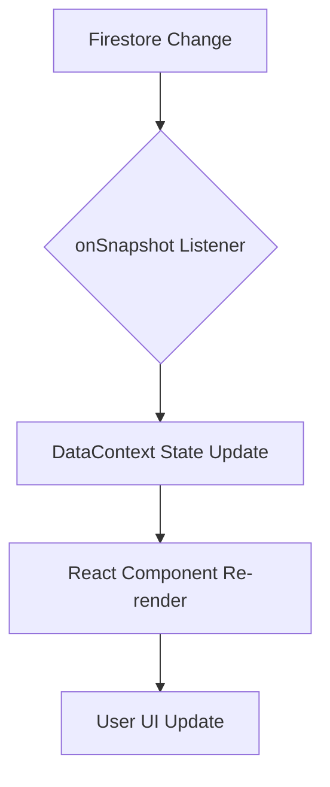

# Code Design & Architecture

This document outlines the core technical design and architectural principles of the **Strategic Knights Subscription Platform**.

## 1. Architectural Overview

The application follows a modern serverless architecture using **Next.js** for the frontend and **Firebase** for the backend services.

### Tech Stack
- **Framework:** Next.js 14+ (App Router)
- **Language:** TypeScript
- **Styling:** Tailwind CSS + Lucide Icons
- **Database:** Firebase Firestore (NoSQL)
- **Authentication:** Firebase Auth
- **State Management:** React Context API (Distributed architecture)

---

## 2. Multi-Tenancy Design

The system implements a robust multi-tenant model to isolate data between different vendors while allowing platform-wide management.

### 2.1 Nested Subcollection Pattern
Each vendor (tenant) has their own dedicated "silo" within Firestore:
- `tenants/{tenantId}/customers`
- `tenants/{tenantId}/products`
- `tenants/{tenantId}/subscriptions`
- `tenants/{tenantId}/invoices`

### 2.2 Global Mirroring & Aggregation
To enable Superadmin views without complex joins, the system employs two strategies:
1.  **Global Mirroring:** When a document is written to a tenant's subcollection, it is simultaneously mirrored to a root-level collection (e.g., a global `customers` collection).
2.  **Collection Groups:** Superadmins use Firestore `collectionGroup` queries to aggregate data across all tenant subcollections in real-time.

---

## 3. Data Flow & State Management

State is managed through specialized React Contexts to ensure data consistency and real-time updates.

### 3.1 Core Contexts
- **`vendor-auth.tsx`:** Manages authentication state, user roles, and tenant identification.
- **`data-context.tsx`:** The primary data hub. It establishes `onSnapshot` listeners to Firestore based on the user's role and tenant context.
- **`products-context.tsx`:** Handles product-specific logic, including category filtering and price calculations.

### 3.2 Real-Time Sync Logic

---

## 4. Security & Access Control

Role-Based Access Control (RBAC) is enforced both at the application level and via Firebase Security Rules.

### 4.1 User Roles
1.  **Superadmin:** Global access to all mirrored root collections and platform metrics.
2.  **Admin:** Operational access to manage vendors and support tickets.
3.  **Vendor:** Restricted to their specific `tenantId` namespace.
4.  **Customer:** Restricted to their own profile and subscriptions.

### 4.2 Data Paths
The `getPath` utility in `lib/data-context.tsx` dynamically resolves data paths based on role:
- **Vendor Path:** `tenants/${tenantId}/${collection}`
- **Global Path:** `${collection}`

---

## 5. Key Design Patterns

### 5.1 Auto-Seeding & Personalization
When a new vendor signs up, the `DataProvider` automatically seeds the database with industry-specific templates (e.g., "Dairy" vs "Grains") based on the `businessType` meta-data.

### 5.2 Dynamic Form Generation
The onboarding flow uses a configuration-driven approach to generate address and delivery forms, ensuring flexibility for different vendor requirements.

### 5.3 GST and Billing
A dedicated `gst-calculator.ts` utility ensures consistent tax calculations across invoices and subscription quotes.

---

## 6. Future Scalability

- **Payment Microservices:** Designed to be extended with custom Razorpay/Stripe webhooks.
- **PWA Capabilities:** The architecture is structured to support offline-first features in future iterations.
- **API Extensibility:** The `api-service.ts` layer provides a foundation for external integrations.

---

## 7. Development Standards & Best Practices (COE)

To maintain code quality and architectural integrity, the following standards should be followed:

### 7.1 Type Safety
- **Strict Typing:** Avoid using `any` where possible. Extend existing interfaces in `types.ts` for new data models.
- **Form Schemas:** Use Zod or similar validation schemas for all user-facing forms.

### 7.2 UI/UX Guidelines
- **Component Reusability:** Favor atomic components from the `components/ui` directory.
- **Responsiveness:** Use Tailwind's utility-first classes (e.g., `md:`, `lg:`) for all layout components.

### 7.3 Data Fetching
- **Hooks over Props:** Use `useData()` or `useVendorAuth()` hooks instead of prop-drilling whenever possible.
- **Loading States:** Every data-fetching component must implement an `isLoading` state or a skeleton fallback.

### 7.4 Performance
- **Optimistic Updates:** Use immediate local state updates for operations like wallet recharges and then sync with Firestore.
- **Memoization:** Wrap complex list transformations in `useMemo` to prevent unnecessary re-renders.
